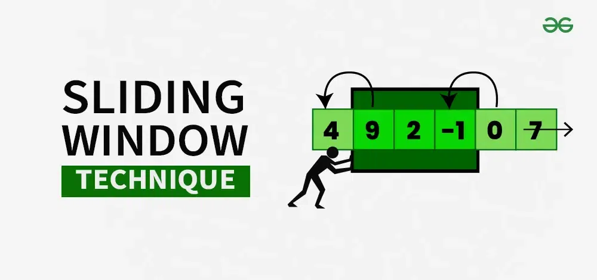

# Documents
https://docs.python.org/3/tutorial/controlflow.html#for-statements

# Conventions
https://medium.com/@rowainaabdelnasser/python-naming-conventions-10-essential-guidelines-for-clean-and-readable-code-fe80d2057bc9#:~:text=For%20class%20names%20in%20Python,clarity%20and%20improve%20code%20comprehension.

# Technique
- [Sliding window](https://www.geeksforgeeks.org/window-sliding-technique/)
    
- 